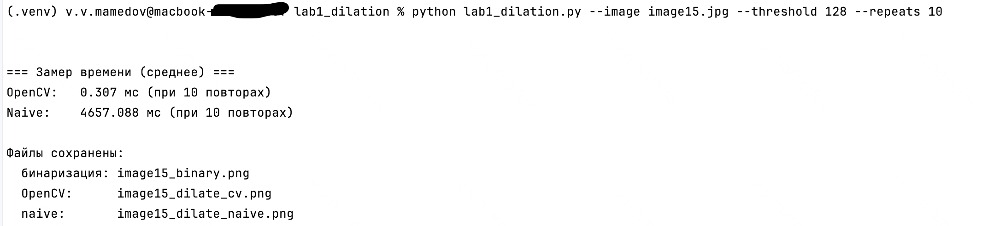

# Лабораторная работа №1

## Обработка изображений — Дилатация (вариант 6)

## 1. Теоретическая база

В этой работе рассматривается морфологическая операция **дилатации**. Она применяется к бинарным изображениям и
используется для того, чтобы “расширять” светлые области.
Если объяснять простыми словами: дилатация делает белые объекты чуть толще. Это удобно, когда нужно удалить мелкие дырки
внутри объектов, соединить разорванные линии или просто увеличить форму.

Обычно дилатация выполняется при помощи так называемого **структурного элемента**. В нашем случае это матрица 3×3,
состоящая из единиц:

```
1 1 1
1 1 1
1 1 1
```

Смысл работы такой:
Если в окрестности 3×3 вокруг пикселя есть хотя бы один белый пиксель, то текущий пиксель становится белым.

Таким образом, белые области "расползаются" и становятся толще.

---

## 2. Описание разработанной системы

Программа реализована на Python и включает два варианта алгоритма:

1. **Дилатация с помощью OpenCV** — быстрый вариант, использующий готовые функции.
2. **Нативная реализация на Python** — собственная ручная реализация без использования морфологических функций, только
   через циклы и анализ соседей.

Перед дилатацией изображение переводится в оттенки серого, а затем бинаризуется обычным пороговым методом:
пиксели ярче порога становятся 255, остальные — 0.

Архитектура программы простая:

* загрузка изображения;
* бинаризация;
* дилатация двумя способами;
* замер времени работы каждого варианта;
* сохранение результата в отдельные файлы.

Это позволяет не только показать работу алгоритма, но и сравнить скорость библиотечного решения и “ручного”.

---

## 3. Результаты работы и тестирования

Для тестирования использовалось простое изображение с текстом и тонкими линиями, чтобы эффект дилатации было видно
максимально отчётливо.

Программа сохраняет следующие изображения:

* `*_binary.png` — изображение после бинаризации;
* `*_dilate_cv.png` — результат дилатации через OpenCV;
* `*_dilate_naive.png` — результат нативной дилатации.

#### Пример наблюдаемых эффектов:

* линии становятся заметно толще;
* небольшие разрывы внутри букв “заливаются”;
* тонкие детали могут пропасть или сливаться.

#### Примерная разница по времени (зависит от размера изображения):

* OpenCV: примерно 0.1–0.3 мс
* Нативная реализация: десятки миллисекунд

OpenCV работает значительно быстрее, что ожидаемо, так как реализован на C++ и оптимизирован под обработку изображений.


---

## 4. Выводы по работе

1. Реализована морфологическая операция дилатации двумя способами: через OpenCV и вручную на Python.
2. Оба варианта дают одинаковый визуальный результат, но библиотечная версия работает намного быстрее.
3. Ручная реализация полезна для понимания принципов морфологических операций, но непригодна для высокопроизводительных
   задач.
4. На разных тестах хорошо видно, как дилатация утолщает объекты, убирает мелкие отверстия и соединяет разорванные
   фрагменты.

---

## 5. Использованные источники

1. Документация OpenCV — раздел по морфологическим операциям: `cv2.dilate`.
2. Методические материалы по лабораторной работе.
