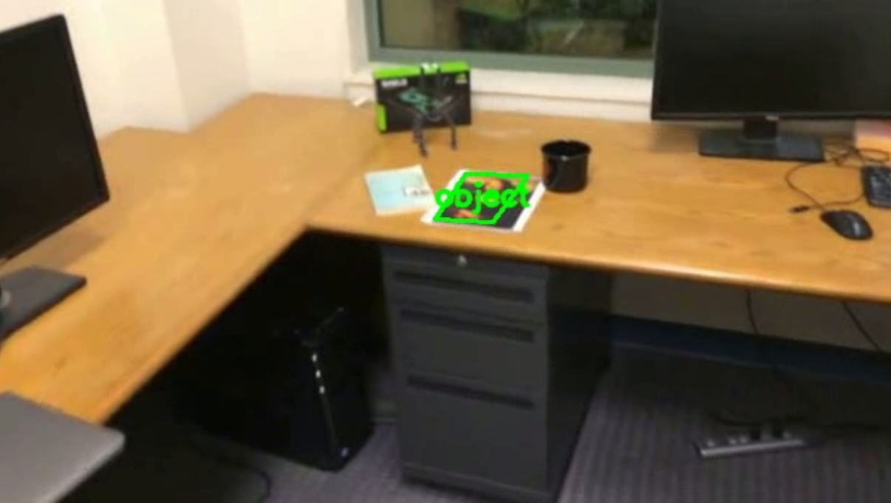
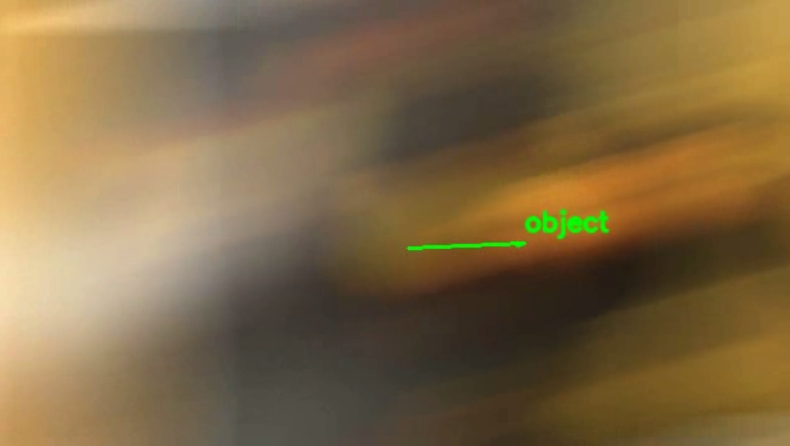
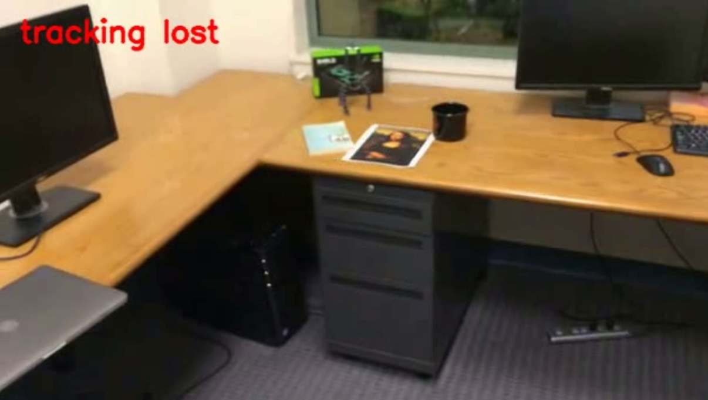
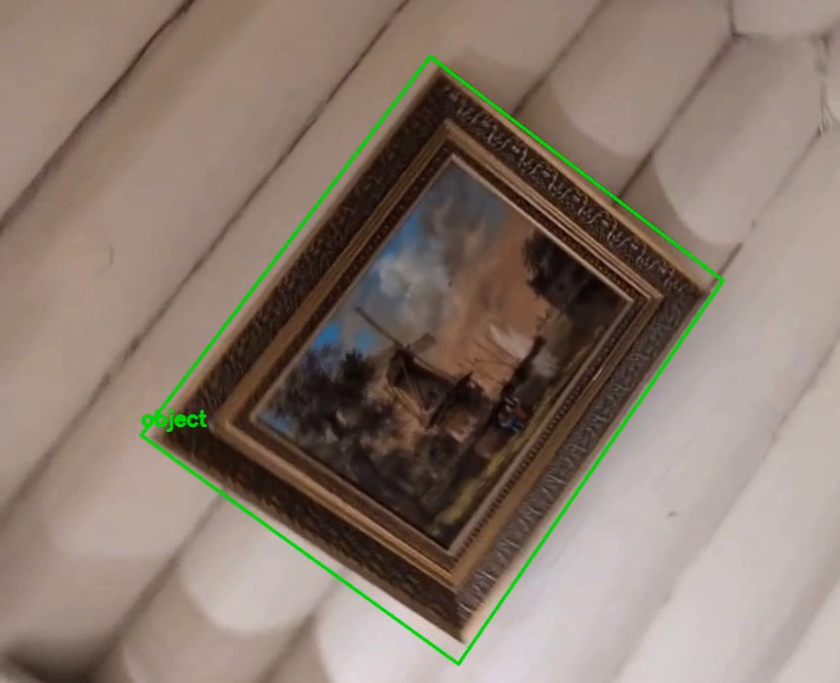

# Лабораторная работа №2
## Трекинг объекта на видео на основе ключевых точек

## 1. Теоретическая база

В этой работе реализован простой трекинг плоского объекта на видео. Идея основана на том, что по ключевым точкам можно сопоставлять объект на разных кадрах, а затем восстанавливать его положение в виде рамки.

### Ключевые точки и дескрипторы
**Ключевые точки** — это “характерные” точки изображения (углы, контрастные детали), которые можно находить и сравнивать между кадрами.

В работе используется **SIFT (Scale-Invariant Feature Transform)**:
- устойчив к повороту и масштабированию;
- даёт информативные дескрипторы для сопоставления;
- обычно работает стабильнее на текстурных объектах.

### Сопоставление (matching)
После извлечения дескрипторов на первом кадре и на текущем кадре выполняется поиск соответствий.

Используется:
- `BFMatcher` с метрикой **L2** (подходит для дескрипторов SIFT);
- `knnMatch(k=2)` + **ratio test (Lowe)**: матч принимается, если лучший вариант заметно лучше второго. Это отсекает часть ложных совпадений.

### Гомография и RANSAC
Так как объект предполагается плоским, его положение на кадре удобно описывать **гомографией** — проектным преобразованием 3×3.

Гомография оценивается по совпавшим точкам с помощью `cv2.findHomography(..., RANSAC, ...)`.

Алгоритм **RANSAC** отбрасывает выбросы (ошибочные матчи) и делает оценку устойчивее.

## 2. Описание разработанной системы

### Условия задачи
Программа принимает видео, где первый кадр — крупный план объекта. На каждом кадре, где объект виден, должна рисоваться рамка и подпись.

Для стабильной работы лучше выбирать объекты с большим количеством текстуры/деталей.

### Принцип работы
1. **Инициализация по первому кадру**
   - первый кадр переводится в градации серого;
   - вычисляются ключевые точки и дескрипторы SIFT — это “модель” объекта.

2. **Обработка каждого следующего кадра**
   - кадр переводится в градации серого;
   - вычисляются ключевые точки и дескрипторы на кадре;
   - выполняется сопоставление дескрипторов (KNN + ratio test);
   - по матчам оценивается гомография RANSAC;
   - если гомография найдена, рисуется рамка объекта; иначе выводится `tracking lost`.

### Как уменьшается “дёрганье” рамки
В `track_keypoints.py` добавлены вспомогательные приёмы:
- **Сохранение предыдущей рамки** (`last_corners`) и использование её как опоры при построении следующей рамки.
- **Построение маски объекта** по текущей рамке (заполнение полигона) и **реинициализация** ключевых точек объекта внутри маски в удачные моменты. Это помогает, когда объект меняет масштаб/ракурс, и набор ключевых точек “стареет”.
- **Проверка геометрии рамки** (примерно равные противоположные углы) и сравнение масок (IoU), чтобы не принимать явно некорректные обновления.

### Структура кода (основные функции)
- `build_detector()` — создание SIFT и настройка параметров.
- `build_matcher()` — BFMatcher (L2).
- `extract_features()` — извлечение ключевых точек/дескрипторов (опционально с маской).
- `match_features()` — KNN matching + ratio test.
- `compute_homography()` — гомография RANSAC.
- `draw_object_bbox()` — отрисовка рамки.
- `get_mask()` — маска объекта по рамке.
- `process_video()` — основной цикл обработки видео.

## 3. Результаты работы и тестирование системы

### Запуск
Скрипт принимает аргументы:
- `-i/--input` — путь к входному видео;
- `-o/--output` — путь к выходному видео (если не указан, видео не сохраняется);
- `--min-matches` — минимальное число совпадений для построения гомографии;
- `--no-show` — не показывать окно (удобно для сохранения результата).

### Тестовые видео
Тестовые файлы находятся в `test-videos/`:
- `mona-lisa.avi`
- `mona-lisa-blur.avi`
- `mona-lisa-blur-extra-credit.avi`
- `picture_test.mp4`

Результаты сохранены в `results/`:
- `mona-lisa-tracked.avi`
- `mona-lisa-blur-tracked.avi`
- `mona-lisa-blur-extra-tracked.avi`
- `picture_test_tracked.mp4`

### Наблюдения
| Видео | Результат | Скриншот |
|------|-----------|-----------|
| mona-lisa.avi | рамка в целом стабильна |  |
| mona-lisa-blur.avi | рамка восстанавливается после размытия |  |
| mona-lisa-blur-extra-credit.avi | периодически происходят потери рамки |  |
| picture_test.mp4 | рамка в целом стабильна |  |

## 4. Выводы по работе
1. Реализован трекинг плоского объекта по ключевым точкам на основе SIFT + matching + гомография (RANSAC).
2. Алгоритм лучше всего работает на текстурных объектах и при умеренных изменениях масштаба/поворота.
3. Основные причины потери трека: сильный блюр, перекрытия, выход объекта из кадра.

## 5. Использованные источники
1. Методические материалы по лабораторной работе.
2. Документация OpenCV: SIFT / BFMatcher / `knnMatch`.
3. Документация OpenCV: `findHomography`, RANSAC.

