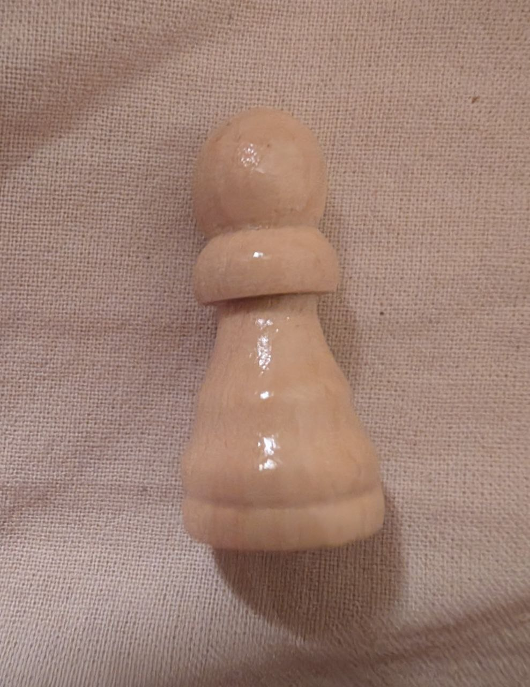
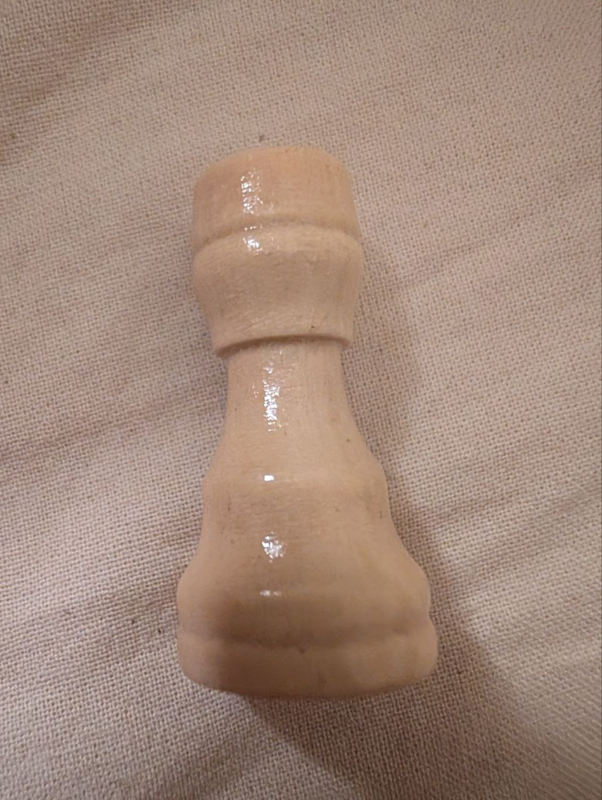
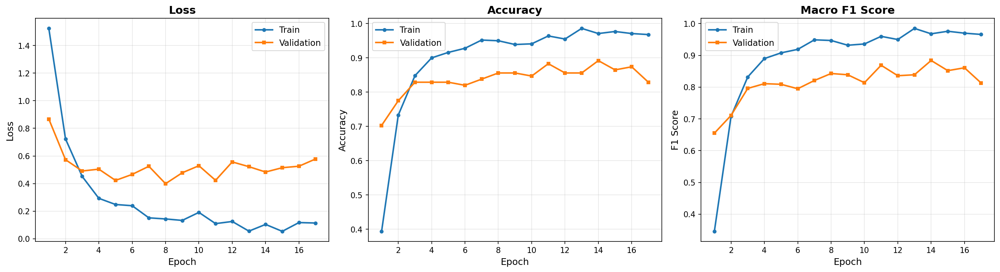
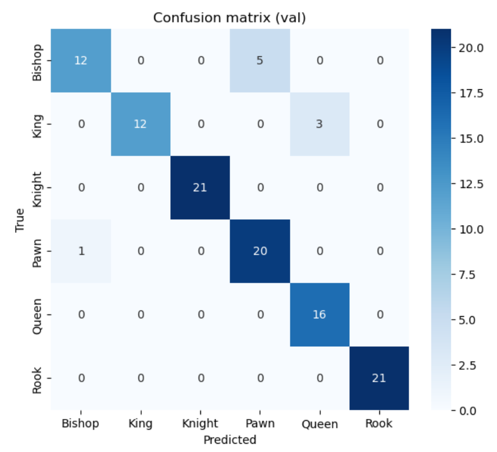
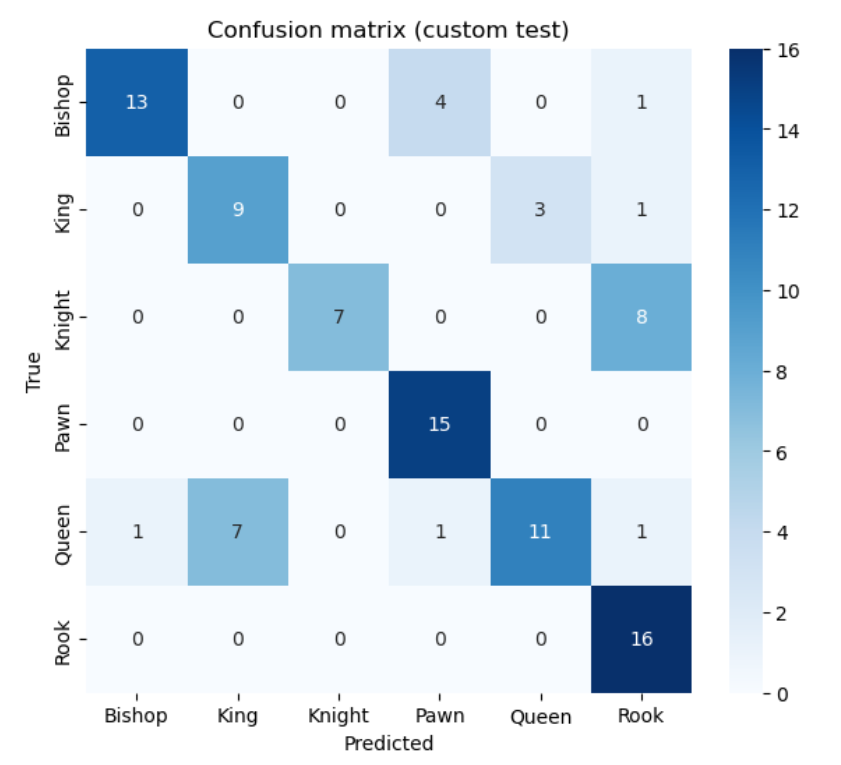

# ЛР3 — Классификация изображений на основе CNN (шахматные фигуры)

## 1. Теоретическая база

**Сверточные нейронные сети (CNN)** — архитектура нейронных сетей, предназначенная для обработки данных с регулярной структурой (изображения, временные ряды). CNN эффективно извлекают локальные признаки с помощью операции свёртки и обладают свойством эквивариантности к сдвигам.

### Ключевые элементы архитектуры CNN

- **Сверточный слой (Conv2D)**: применяет набор обучаемых фильтров (ядер) к входному изображению, извлекая локальные признаки (границы, текстуры, формы). Каждый фильтр детектирует определённый паттерн.

- **Функция активации ReLU**: $f(x) = \max(0, x)$ — вносит нелинейность, позволяя сети обучаться сложным зависимостям. ReLU решает проблему затухающего градиента и ускоряет обучение.

- **Пулинг (Pooling)**: уменьшает пространственные размеры карт признаков, снижая вычислительную сложность и обеспечивая инвариантность к небольшим сдвигам. Max Pooling выбирает максимальное значение в окне.

- **Полносвязный слой (FC)**: преобразует извлечённые признаки в выходные logits для каждого класса.

### Transfer Learning

**Transfer Learning** (перенос обучения) — подход, при котором модель, предобученная на большом датасете (например, ImageNet с 1.2M изображений и 1000 классов), используется как начальная точка для решения новой задачи.

Преимущества:
- Ранние слои сети уже умеют выделять универсальные низкоуровневые признаки (края, текстуры)
- Значительно ускоряет обучение на малых датасетах
- Повышает качество за счёт более качественных начальных весов

### Fine-tuning

**Fine-tuning** — дообучение части слоёв предобученной модели на новых данных:
- Ранние слои (низкоуровневые признаки) обычно замораживаются
- Глубокие слои (высокоуровневые признаки) размораживаются для адаптации к новой задаче
- Используются разные learning rate: меньший для предобученных слоёв, больший для нового классификатора

### Loss-функция

**Cross-Entropy Loss** — стандартная функция потерь для многоклассовой классификации:

$$L = -\sum_{i=1}^{C} y_i \log(\hat{y}_i)$$

где $y_i$ — истинная метка (one-hot), $\hat{y}_i$ — предсказанная вероятность класса после softmax.

### Метрики качества

- **Accuracy**: доля правильных предсказаний $\frac{TP + TN}{Total}$
- **Balanced Accuracy**: среднее recall по всем классам, не зависит от дисбаланса
- **Macro F1**: среднее F1-score по классам, учитывает precision и recall
- **Confusion Matrix**: матрица ошибок, показывающая, какие классы модель путает

## 2. Описание разработанной системы

### Цель работы

Научиться создавать простые системы классификации изображений на основе сверточных нейронных сетей.

### Задача

Построить модель, которая по изображению определяет класс шахматной фигуры: **Bishop / King / Knight / Pawn / Queen / Rook** (6 классов).

### Датасет

**Train/Val датасет:**
- Источник: Kaggle `niteshfre/chessman-image-dataset` (версия 1)
- Объём: 553 изображения, 6 классов
- Формат: цветные изображения различного разрешения

**Test датасет (собственный):**
- Собрано и размечено вручную: 98 изображений
- Разнообразие: различные фоны, освещение, ракурсы съёмки

Структура данных:

```text
data/
  chessman-image-dataset/
    Chess/
      Bishop/
      King/
      Knight/
      Pawn/
      Queen/
      Rook/

test_custom/
  Bishop/
  King/
  Knight/
  Pawn/
  Queen/
  Rook/
```

### Примеры изображений из датасетов

**Train/Val датасет (Kaggle)** — студийные рендеры с чистым фоном:

| Bishop | King | Knight | Pawn | Queen | Rook |
|:------:|:----:|:------:|:----:|:-----:|:----:|
|  |  |  |  |  |  |

**Test датасет (собственный)** — реальные фотографии с различным освещением и фоном:

| Bishop | King | Knight | Pawn | Queen | Rook |
|:------:|:----:|:------:|:----:|:-----:|:----:|
|  |  |  |  |  |  |

*Видно существенное различие между датасетами: train содержит идеализированные изображения, test — реальные фото с шумом и вариативностью.*

### Архитектура модели

**Базовая модель:** ResNet-18 (Residual Network с 18 слоями)

ResNet-18 состоит из:
- Начальный свёрточный слой (conv1) + BatchNorm + ReLU + MaxPool
- 4 блока residual-слоёв (layer1-layer4), каждый с skip-connections
- Global Average Pooling
- Полносвязный классификатор (fc)

**Модификации для задачи:**
1. Загружены веса, предобученные на ImageNet (`ResNet18_Weights.DEFAULT`)
2. Заменён последний слой: `fc = Linear(512, 6)` для 6 классов шахматных фигур
3. Fine-tuning стратегия:
   - Заморожены: `conv1`, `layer1`, `layer2` (низкоуровневые признаки)
   - Разморожены: `layer3`, `layer4`, `fc` (высокоуровневые признаки + классификатор)

### Гиперпараметры обучения

| Параметр | Значение |
|----------|----------|
| Оптимизатор | AdamW |
| Learning rate (layer3, layer4) | 1e-4 |
| Learning rate (fc) | 1e-3 |
| Weight decay | 1e-4 |
| Scheduler | ReduceLROnPlateau (factor=0.5, patience=3) |
| Batch size | 16 |
| Max epochs | 25 |
| Early stopping patience | 7 |
| Train/Val split | 80% / 20% (stratified) |

### Аугментации данных

Для предотвращения переобучения и улучшения обобщающей способности применены аугментации:

| Аугментация | Параметры |
|-------------|-----------|
| RandomResizedCrop | size=224, scale=(0.7, 1.0) |
| RandomHorizontalFlip | p=0.5 |
| RandomRotation | degrees=15 |
| RandomPerspective | distortion_scale=0.2, p=0.3 |
| ColorJitter | brightness=0.3, contrast=0.3, saturation=0.3, hue=0.1 |
| GaussianBlur | kernel_size=3, sigma=(0.1, 1.0) |
| Normalize | mean=(0.485, 0.456, 0.406), std=(0.229, 0.224, 0.225) |

### Системные требования

- Python 3.10+ (в проекте используется Python 3.12)
- PyTorch 2.0+
- torchvision
- numpy, matplotlib, seaborn
- scikit-learn
- tqdm

Установка зависимостей:

```bash
pip install -r requirements.txt
```

### Запуск

1. Настроить Kaggle API token (`~/.kaggle/kaggle.json`)
2. Открыть и выполнить ноутбук `lab3.ipynb`
3. Датасет скачается автоматически при первом запуске

## 3. Результаты работы и тестирования

### 3.1. Статистика датасета

**Train/Val (Kaggle):**

```
Total: 553 изображения, 6 классов
  Bishop    :  86
  King      :  76
  Knight    : 106
  Pawn      : 106
  Queen     :  77
  Rook      : 102

Train: 442 изображения (80%)
Val:   111 изображений (20%)
```

**Test (собственный):**

```
Total: 98 изображений
  Bishop    : 18
  King      : 13
  Knight    : 15
  Pawn      : 15
  Queen     : 21
  Rook      : 16
```

### 3.2. Процесс обучения

Модель обучалась 21 эпоху (early stopping сработал на 21-й эпохе). Лучшая модель сохранена на 14-й эпохе.

**Динамика обучения (первые/последние эпохи):**

| Epoch | Train Loss | Train Acc | Train F1 | Val Loss | Val Acc | Val F1 |
|-------|------------|-----------|----------|----------|---------|--------|
| 1 | 1.5238 | 0.394 | 0.346 | 0.8671 | 0.703 | 0.655 |
| 8 | 0.1436 | 0.950 | 0.947 | 0.3990 | 0.856 | 0.843 |
| 14 | 0.1040 | 0.971 | 0.968 | 0.4835 | 0.892 | **0.884** |
| 21 | - | - | - | - | - | early stop |

**Графики обучения:**



*Loss, Accuracy и Macro F1 на train/val по эпохам. Видно стабильное улучшение качества без значительного переобучения.*

### 3.3. Результаты на валидационной выборке

| Метрика | Значение |
|---------|----------|
| **Accuracy** | **91.89%** |
| **Balanced Accuracy** | **90.97%** |
| **Macro F1** | **91.21%** |

**Per-class метрики (validation):**

| Класс | Precision | Recall | F1-Score | Support |
|-------|-----------|--------|----------|---------|
| Bishop | 0.92 | 0.71 | 0.80 | 17 |
| King | 1.00 | 0.80 | 0.89 | 15 |
| Knight | 1.00 | 1.00 | 1.00 | 21 |
| Pawn | 0.80 | 0.95 | 0.87 | 21 |
| Queen | 0.84 | 1.00 | 0.91 | 16 |
| Rook | 1.00 | 1.00 | 1.00 | 21 |

**Confusion Matrix (validation):**



### 3.4. Результаты на собственном тестовом наборе

| Метрика | Значение |
|---------|----------|
| **Accuracy** | **72.45%** |
| **Balanced Accuracy** | **73.42%** |
| **Macro F1** | **71.66%** |

**Per-class метрики (test_custom):**

| Класс | Precision | Recall | F1-Score | Support |
|-------|-----------|--------|----------|---------|
| Bishop | 0.93 | 0.72 | 0.81 | 18 |
| King | 0.56 | 0.69 | 0.62 | 13 |
| Knight | 1.00 | 0.47 | 0.64 | 15 |
| Pawn | 0.75 | 1.00 | 0.86 | 15 |
| Queen | 0.79 | 0.52 | 0.63 | 21 |
| Rook | 0.59 | 1.00 | 0.74 | 16 |

**Confusion Matrix (test_custom):**



### 3.5. Анализ результатов

**Лучше всего распознаются:**
- **Pawn**: 100% recall — все фигуры распознаны правильно
- **Rook**: 100% recall — ладья имеет характерную форму
- **Bishop**: 72% recall с высокой precision (93%)

**Хуже всего распознаются:**
- **Knight**: 47% recall — модель редко предсказывает этот класс, хотя если предсказывает — то точно (100% precision)
- **Queen**: 52% recall — путается с другими фигурами

**Domain Shift:**

Разрыв между val (91.89%) и test (72.45%) = **~19%** объясняется различиями в данных:
- Train/Val: студийные рендеры с однородным фоном (Kaggle)
- Test: реальные фотографии с различным освещением, фоном, ракурсами

### 3.6. Проверка на переобучение

Модель **не переобучилась** критически:
- Val F1 продолжал расти до 14-й эпохи
- Разница train/val accuracy на момент остановки: ~8% (приемлемо)
- Early stopping предотвратил дальнейшее переобучение
- ReduceLROnPlateau снижал LR при стагнации метрик

## 4. Выводы

1. **Transfer Learning эффективен**: модель ResNet-18, предобученная на ImageNet, успешно адаптировалась к классификации шахматных фигур. На валидационной выборке достигнута accuracy 91.89% за 14 эпох обучения.

2. **Fine-tuning критически важен**: размораживание глубоких слоёв (layer3, layer4) с дифференциальным learning rate позволило модели адаптироваться к специфике данных, сохранив при этом качественные низкоуровневые признаки.

3. **Аугментации улучшают обобщение**: применение RandomPerspective, ColorJitter, GaussianBlur помогло модели лучше справляться с вариативностью тестовых данных.

4. **Domain shift остаётся проблемой**: разрыв ~19% между val и test показывает, что модель, обученная на студийных рендерах, хуже работает на реальных фотографиях. Для улучшения необходимы:
   - Более разнообразные обучающие данные (реальные фото)
   - Domain adaptation техники
   - Увеличение объёма собственного датасета

5. **Balanced Accuracy — корректная метрика**: при несбалансированных классах в test-наборе эта метрика даёт более честную оценку качества модели.

6. **Early stopping и scheduler** предотвратили переобучение и позволили найти оптимальную точку остановки обучения.

## 5. Использованные источники

**Датасет:**
- Kaggle: [Chessman Image Dataset](https://www.kaggle.com/datasets/niteshfre/chessman-image-dataset)

**Фреймворки и библиотеки:**
- [PyTorch Documentation](https://pytorch.org/docs/stable/index.html)
- [Torchvision Models](https://pytorch.org/vision/stable/models.html)
- [Scikit-learn Metrics](https://scikit-learn.org/stable/modules/model_evaluation.html)

**Теория:**
- He, K., et al. "Deep Residual Learning for Image Recognition" (2015). [arXiv:1512.03385](https://arxiv.org/abs/1512.03385)
- [CS231n: Transfer Learning](https://cs231n.github.io/transfer-learning/)
- [PyTorch Transforms](https://pytorch.org/vision/stable/transforms.html)

